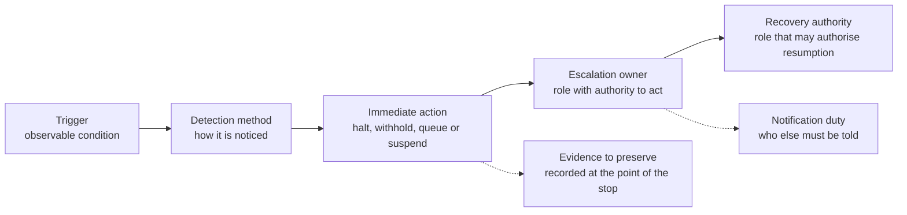

# Stop rules

**Version:** 2026-09-16  
**Last reviewed:** 2026-09-16  
**Author:** Samuel Tait  
**Licence:** CC BY 4.0 (see [LICENSE](../LICENSE))

---

## Definition

A stop rule is a pre-agreed, observable condition that prevents further processing or external action by the AI capability and routes control to a named accountable person. Stop rules are defined before deployment, not in response to incidents.

Stop rules are not confidence thresholds. A stop rule is triggered by a specific observable state (a data pattern, a detected content type, a missing input, an action boundary crossed, or a system failure), not by an AI model's internal score.

Stop rules are a governance instrument. They make human control concrete: they specify *what* stops the AI, *who* takes control, *what* evidence must be preserved, and *who* may restart the process after the stop condition is resolved.

**Silence is not permission.** A stop-rule set is finite and the situations a workflow meets are not. Where the workflow meets a situation with no comparable precedent, the absence of a matching stop rule must never be read as permission to proceed. "No comparable case" is a first-class stop state in this guide (category 13): it routes to a named person and into the review loop, and the review decides whether a new rule, a scope change or a reassessment is needed.

---

## Structure of a stop rule

Each stop rule in a use case must specify:

| Field | Description |
|---|---|
| **Trigger** | The observable condition that activates the rule. Specific, not vague. |
| **Detection method** | How the trigger is detected: automated check, user-initiated flag, monitoring alert, or periodic review. |
| **Immediate action** | What happens the moment the trigger fires: halt processing, withhold output, queue for review, or suspend the capability. |
| **Escalation owner** | The role (not just a name) that receives the escalation and has authority to act on it. |
| **Evidence to preserve** | What must be recorded at the point of the stop: input, output, trigger condition, timestamp, session context. |
| **Recovery authority** | The role that may authorise resumption after the condition is resolved. This may or may not be the same as the escalation owner. |
| **Notification duty** | Who else must be told that the stop rule fired: the affected person, a service manager, a regulator, a privacy officer? |

How the seven fields fit together. The table above defines them; the diagram
shows the order in which they fire.

---

## Stop rule categories

Define the stop rules for your use case from the following categories. Not all categories will apply to every use case; select those that are relevant and define specific trigger conditions for each. Category 13, "No comparable case", applies to every use case.

### Category 1: Unsafe or prohibited content or action

**Trigger:** The AI output contains, or the requested action involves, content or an action that is prohibited by policy, law, or the use-case scope, including harmful content, discriminatory language, instructions that could cause harm, or an action outside the approved boundary.

**Example triggers:** Output that contains a threat or instruction to harm a person; output that discloses a prohibited data category; a request that the AI tool cannot and must not satisfy within its defined scope.

**Immediate action:** Withhold output; do not forward to any external system or person; flag for review.

---

### Category 2: Sensitive-data boundary breach

**Trigger:** Input or output contains a data category that is outside the approved purpose or data boundary for this use case, such as health information in a service not authorised for health data, or personal data about a third party not party to the interaction.

**Immediate action:** Halt processing of that input; quarantine the output; notify the privacy or data-governance function.

---

### Category 3: Missing or conflicting evidence

**Trigger:** The AI capability is asked to process an input where required information is absent, ambiguous, or contradictory in a way that materially affects the reliability of the output, and the system cannot surface this uncertainty to the reviewing person.

**Immediate action:** Do not produce an output that conceals the uncertainty; surface the gap to the reviewing person or escalate.

---

### Category 4: Unusual volume or repeated action

**Trigger:** The system is processing a volume of requests, or repeating an action, that exceeds the defined operational norm, suggesting a batch error, a loop, or an unexpected use pattern.

**Immediate action:** Throttle or pause processing; alert the monitoring function; do not execute further actions until reviewed.

---

### Category 5: Tool or system failure

**Trigger:** The AI capability, an integrated system, an API, or a data source fails, returns an error, or produces an output that the system cannot interpret, in a way that could cause the capability to proceed with incomplete or incorrect information.

**Immediate action:** Halt processing; do not execute pending actions; alert the responsible technical owner; confirm the fallback process is activated.

---

### Category 6: Outcome-quality threshold breach

**Trigger:** A monitored quality measure (error rate in the sampled review, reviewer override rate, complaint rate, or another observable quality signal agreed during assessment) crosses a defined threshold. The model's own confidence score is not a quality measure for this purpose.

**Immediate action:** Pause the capability pending review; do not suppress the monitoring alert; notify the oversight function.

---

### Category 7: Drift or unexpected population

**Trigger:** The input population, data distribution, or task type has shifted materially from what was assessed, in a way that may invalidate the original risk assessment or produce systematically different outputs.

**Immediate action:** Flag for review; do not extend the use case to the new population or context without a documented reassessment.

---

### Category 8: Complaint or appeal

**Trigger:** A person affected by the AI-assisted process has raised a complaint or appeal about the output, process, or decision.

**Immediate action:** Record the complaint; suspend automated processing of that person's case pending review; notify the designated complaints handler.

---

### Category 9: Security event

**Trigger:** A suspected or confirmed attempt to manipulate the AI input (prompt injection), extract data, bypass a control, or exploit the capability in a way not within its intended use.

**Immediate action:** Halt the affected session; preserve the full interaction log; notify the security function; do not resume until the event is investigated.

---

### Category 10: Discriminatory pattern

**Trigger:** Monitoring or a complaint reveals that the AI capability is producing outputs that are systematically less favourable to a population group defined by a protected characteristic.

**Immediate action:** Pause the capability; notify the risk and equity function; do not resume until the cause is investigated and the output pattern is corrected.

---

### Category 11: Material scope change

**Trigger:** A change to the model, prompt, data source, workflow, or user group has occurred that was not captured in the original risk assessment, and the change is material enough that the original tier assignment may no longer hold.

**Immediate action:** Pause the capability; trigger a new risk assessment before resumption; notify the accountable person.

---

### Category 12: Approver unavailability

**Trigger:** At Act with approval tier, the named accountable approver (and all documented deputies) are unavailable within the timeframe required by the workflow, and no other authorised person can approve the pending action.

**Immediate action:** Do not proceed; hold the pending action; activate the documented fallback process (which may be manual handling or deferral, not automated approval).

---

### Category 13: No comparable case

This category applies to every use case. It is the stop rule for the situation no other stop rule anticipated.

| Field | Definition for this category |
|---|---|
| **Trigger** | The workflow meets an input, request or situation with no comparable precedent in the assessed scope: no matching category on the approved list, a combination of factors not seen in shadow mode or the sampled review, a population or context not assessed, or two applicable rules that point in different directions with no rule that decides between them. |
| **Detection method** | Automated: a category-match or scope check that returns "no match" rather than the nearest match; a rule-conflict check that returns "unresolved" rather than picking one. Manual: the reviewing person or approver flags "I have not seen this before" or "the rules disagree here", without needing to justify why. |
| **Immediate action** | Do not produce a routine output, decision or prepared action. Return an explicit "no comparable case" state, not a best guess. Hold the item and route it to a person. |
| **Escalation owner** | The accountable role for the tier (Assist: the user's team leader; Advise: the reviewer's decision owner; Act with approval: the approver role). That role decides the individual case by the manual process. |
| **Evidence to preserve** | The input, the check result that returned "no match" or "unresolved", the candidate categories or rules considered, timestamp, and the person's decision on the case. |
| **Recovery authority** | The use-case owner, under change control (question bank, section 10). Recovery means one of: a new rule or category is added and the scope is reassessed; the situation is confirmed as permanently manual; or the use case is reassessed for tier. The individual case never restarts the automated path on its own. |
| **Notification duty** | The use-case owner is told of every activation; the risk function is told when the same "no comparable case" pattern recurs, since a recurring unknown is a scope gap, not an anomaly. |

*Adapted from the "unknown" band of the four-band fast path in Simon Spencer and Edgelabs, "The Conscience Graph" (v0.2, September 2026), sections 5.8 and 6 ("unknown is not comfort"), CC BY 4.0. The four-band fast path is Spencer's and is not reproduced here; what is adapted is the single principle that an unmatched case is undefined rather than safe, applied to an organisation's control decisions over a workflow rather than to an agent's internal filter. The Conscience Graph is a design proposal; its authors report no implementation or evaluation. See [REFERENCES.md](../REFERENCES.md).*

---

## Defining stop rules for your use case

Use the structure above to draft a stop-rule set before deployment. The set should be attached to the use-case assessment record (see [02-decision-rights/question-bank.md](../02-decision-rights/question-bank.md), section 8).

A use case with no defined stop rules has not completed its governance assessment.

---

## Common drafting errors to avoid

- **Vague triggers:** "Output is low quality" is not a stop rule. "The reviewer override rate in the current week exceeds X%" is a stop rule.
- **Confidence thresholds as stop rules:** A model's internal confidence score is not an observable external trigger. Define what the output or state looks like, not what the model reports internally.
- **Escalation without a named owner:** Every stop rule must name a role. "Escalate to management" is not specific enough to be actionable.
- **No recovery authority:** Stopping a process without defining who may restart it leaves the capability in limbo. Always specify the recovery authority separately from the escalation owner.
- **No notification duty:** Some stop-rule activations must be disclosed: to affected people, to auditors, to regulators. Define this before deployment.
- **No rule for the unanticipated case:** A stop-rule set that only lists the failures you thought of will read every other failure as permission. Always include category 13.
- **Recovery that loosens:** The recovery authority restores the capability under the same or tighter conditions, never looser ones because the queue has grown while the capability was stopped. See "After an incident: tighten under load" in [03-oversight-patterns/oversight-patterns.md](../03-oversight-patterns/oversight-patterns.md).
