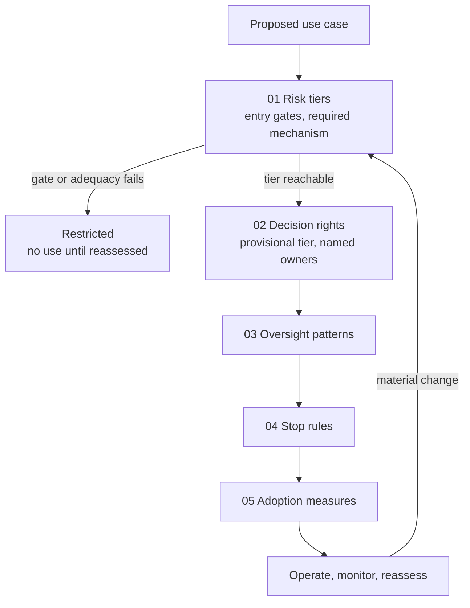

# AI Adoption Field Guide

**Version:** 2026-09-16  
**Last reviewed:** 2026-09-16  
**Author:** Samuel Tait  
**Licence:** [CC BY 4.0](LICENSE)

> **Repository description (for GitHub):** A practical, open guide to assigning proportionate human control to AI-assisted workflows: risk tiers, decision rights, oversight patterns, stop rules, and adoption and benefits-realisation measures. Organised on Australia's Guidance for AI Adoption and mapped to NIST AI RMF. CC BY 4.0.
>
> **Topics (for GitHub):** `ai-governance` `ai-adoption` `risk-management` `decision-rights` `human-in-the-loop` `ai-policy` `australia` `nist-ai-rmf` `enterprise-ai` `responsible-ai`

---

## Purpose

This guide helps organisations assign proportionate human control to AI-assisted workflows, define who decides and who intervenes, and measure adoption and benefits without treating the guide as legal advice, certification, or a substitute for sector-specific regulatory obligations.

**Who it is for:** Transformation executives, AI and product leads, risk and governance teams, service owners, and technical architects responsible for moving AI use cases from proposal to controlled operation.

**What it covers:**

- A four-tier model organised on Australia's Guidance for AI Adoption practice 6, "Maintain human control": the tiers are the forms of human control an organisation can actually exercise (per-output review, per-decision record, per-action gate, or none). Practices 1 and 2 act as entry gates. A mapping table shows the form every one of the six practices and the four NIST AI RMF functions takes at each tier.
- A decision-rights question bank that leads to a provisional tier and named decision owners.
- Eight oversight patterns with prerequisites, failure modes, and escalation routes.
- Thirteen stop-rule categories, including a first-class "No comparable case" state, with a structured template for defining rules for a specific use case.
- Adoption and benefits-realisation measures, with a baseline-then-measure discipline.
- Three fictional worked examples landing on different tiers: local council service request triage (Advise), university student enquiries (Assist, self-service variant), and retail returns and customer resolution (Assist, Advise and Act with approval across three tracks).
- One illustration from a real, documented incident (the OpenAI ExploitGym / Hugging Face incident, July 2026), read through the guide's lens. It is kept separate from the fictional examples and is an illustration only, not the basis of the model.

**What it does not do:** Certify compliance, guarantee legal adequacy, or replace specialist legal, regulatory, or sector-specific guidance.

**Primary context:** Australia. The risk tier model is organised on Australia's Guidance for AI Adoption (six essential practices) and notes the DTA Policy for the responsible use of AI in government (effective December 2025). Most of the governance principles are broadly applicable.

---

## Why tiers and stop rules, not a rule list

Most organisations start AI governance with a list of rules: do this, never do that. Rule lists fail in three ways that a tier model with stop rules is designed to catch.

- **Coverage.** A rule list is finite and the situations a workflow meets are not. Behaviour at the boundary is undefined, and the list's silence gets read as permission. This guide treats "no comparable case" as a first-class state that stops the workflow and routes to a person (stop-rule category 13).
- **Conflict.** Rules collide, and a rule list has no native way to resolve a collision except another rule about which rule wins. People resolve conflicts by weight. This guide resolves them by naming the accountable role who decides, and by treating an unresolved conflict as an escalation, not a coin toss (mandatory trigger 13).
- **Brittleness.** A rule matches the literal form of a request. Reword or reorder the request and the rule does not fire. This guide tests for that before deployment (consistency under reframing, in the oversight patterns) and keys its stop rules to observable states rather than to phrasing.

*Adapted from Simon Spencer and Edgelabs, "The Conscience Graph" (v0.2, September 2026), section 4.1, CC BY 4.0. Spencer's subject is an agent's internal pre-reasoning filter; this guide applies the three failure modes to an organisation's control decisions over an AI-assisted workflow. The Conscience Graph is a design proposal; its authors report no implementation or evaluation. See [REFERENCES.md](REFERENCES.md).*

---

## How to use this guide

**For a new use case:** Start with [QUICKSTART.md](QUICKSTART.md).

**For a tier decision:** Read [01-risk-tiers/risk-tier-model.md](01-risk-tiers/risk-tier-model.md), especially the entry gates, the tier factors and the mandatory escalation triggers, then work through the [decision-rights question bank](02-decision-rights/question-bank.md).

**To design oversight:** Consult [03-oversight-patterns/oversight-patterns.md](03-oversight-patterns/oversight-patterns.md) and select the patterns appropriate for the tier and use case.

**To define stop rules:** Use the categories and structure in [04-stop-rules/stop-rules.md](04-stop-rules/stop-rules.md) to draft the specific rules for the use case.

**To set up measurement:** Use [05-adoption-measures/measures.md](05-adoption-measures/measures.md) to select and baseline the measures before deployment.

**For examples:** The worked examples in [06-worked-examples/](06-worked-examples/) show how the model, question bank, patterns, stop rules, and measures apply in three different fictional settings.

**For a real case:** [07-incident-illustration/exploitgym-2026.md](07-incident-illustration/exploitgym-2026.md) reads a real, documented incident through the guide. It is an illustration, not the basis of the model, and it states its research-context limits up front.

How the sections fit together for a new use case. Sections 01 to 05 run in order, and the loop closes when a material change sends the use case back for reassessment. The worked examples (06) and the incident illustration (07) are reference, not steps, so they do not appear below.



---

## Guide structure

```
ai-adoption-field-guide/
├── README.md                                      ← Start here
├── QUICKSTART.md                                  ← Five-step deployment checklist
├── CHANGELOG.md                                   ← Version history
├── CONTRIBUTING.md                                ← How to report errors and propose changes
├── AGENTS.md                                      ← Repository rules for contributors and agents
├── CODE_OF_CONDUCT.md                             ← Conduct in issues and pull requests
├── LICENSE                                        ← CC BY 4.0, unmodified legal code
├── THIRD_PARTY_NOTICES.md                         ← Referenced and adapted work, and its rights
├── CITATION.cff                                   ← Citation metadata
├── GLOSSARY.md                                    ← Key terms
├── LIMITATIONS.md                                 ← Scope and caveats
├── REFERENCES.md                                  ← Source register
├── .github/                                       ← Issue and pull request templates only
├── 01-risk-tiers/
│   └── risk-tier-model.md                         ← Entry gates, four tiers, mapping table
├── 02-decision-rights/
│   └── question-bank.md                           ← Ten-section assessment questionnaire
├── 03-oversight-patterns/
│   └── oversight-patterns.md                      ← Eight reusable oversight arrangements
├── 04-stop-rules/
│   └── stop-rules.md                              ← Thirteen stop-rule categories and template
├── 05-adoption-measures/
│   └── measures.md                                ← Adoption, control, outcome, risk, sustainment
├── 06-worked-examples/                            ← Fictional examples only
│   ├── local-council-service-requests.md          ← Advise
│   ├── university-student-enquiries.md            ← Assist, self-service variant
│   └── retail-returns-resolution.md               ← Assist + Advise + Act with approval
└── 07-incident-illustration/
    └── exploitgym-2026.md                          ← Real documented incident, read through the guide
```

---

## Related work

The tier model is organised on the following primary frameworks. It does not reproduce their text.

- **Australia's Guidance for AI Adoption** (National AI Centre, October 2025; implementation guidance May 2026): https://www.ai.gov.au/staying-safe-and-responsible/essential-ai-practices/guidance-ai-adoption-implementation-guidance
- **NIST AI Risk Management Framework 1.0** (NIST, January 2023): https://www.nist.gov/itl/ai-risk-management-framework

The tiered approach to AI decision authority in this guide builds on **Paweł Huryn's "The Intent Engineering Framework for AI Agents"** (*Product Compass*, 13 January 2026), which sets out a hierarchy of decision types and autonomy levels ordered by blast radius and reversibility and introduces stop rules and health metrics as governance concepts. This guide's contribution is the Australian regulatory grounding, the reorganisation of the tiers on practice 6 with practices 1 and 2 as entry gates, the mapping of every practice and NIST function to each tier, the decision-rights question bank, the oversight pattern library, the stop-rule category set, and the worked examples. Huryn's level names and seven-part specification are not used. See [REFERENCES.md](REFERENCES.md).

Four mechanisms in the supporting sections are adapted, with changes marked in place, from **Simon Spencer and Edgelabs, "The Conscience Graph: a built-in, layered, provenanced value graph for AI reasoning"** (position paper, v0.2, September 2026, CC BY 4.0), which is the source concept: the three ways rule lists fail (section 4.1, used in the rationale above); the "unknown" band of its four-band fast path (sections 5.8 and 6), adapted as stop-rule category 13, "No comparable case"; the rule that plasticity falls under load (section 5.9), adapted as "tighten under load" in the oversight patterns; and two stages of its evaluation protocol (section 8.3), adapted as pre-deployment test designs. Spencer's subject is an agent's internal pre-reasoning filter; this guide applies each mechanism to an organisation's control decisions. The concept, the layered model, the four-band fast path, re-attribution and qualification-bound delegation caps are Spencer's and are not claimed here. The Conscience Graph is a design proposal; its authors report no implementation or evaluation.

---

## Licence and attribution

Original guide text is licensed under [Creative Commons Attribution 4.0 International (CC BY 4.0)](https://creativecommons.org/licenses/by/4.0/). You are free to share and adapt it for any purpose, including commercial use, provided you give appropriate credit, link to the licence, and indicate changes.

Referenced works (Australian Guidance for AI Adoption, NIST AI RMF, Huryn, Spencer) retain their own rights and are not covered by this licence. Passages adapted from Spencer's CC BY 4.0 paper are marked in place with the changes made; they may be reused under CC BY 4.0 with attribution to Simon Spencer and Edgelabs as well as to this guide.

**To cite this guide:**  
Tait, S. (2026). *AI Adoption Field Guide*. https://github.com/samueltait/ai-adoption-field-guide. CC BY 4.0.

---

## Limitations and disclaimer

See [LIMITATIONS.md](LIMITATIONS.md). In summary: this guide is not legal advice, certification, or a substitute for sector-specific regulatory obligations. The fictional examples are for illustration only. The tier you assign is a starting point, not a compliance determination.

---

## Maintenance

This guide is reviewed when the Australian Guidance for AI Adoption or NIST AI RMF materially changes, when a cited source changes, when a material error is reported, or at least annually. After 18 months without review, a staleness notice will be added to this README.

Corrections, additions, or suggestions: see [CONTRIBUTING.md](CONTRIBUTING.md) and open an issue in this repository.
